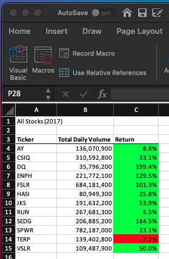
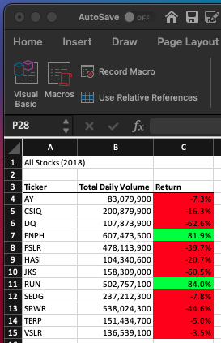
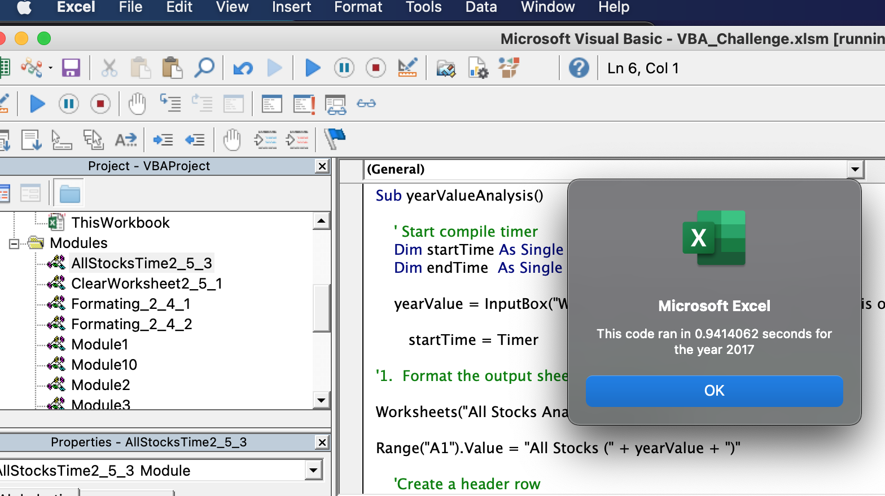
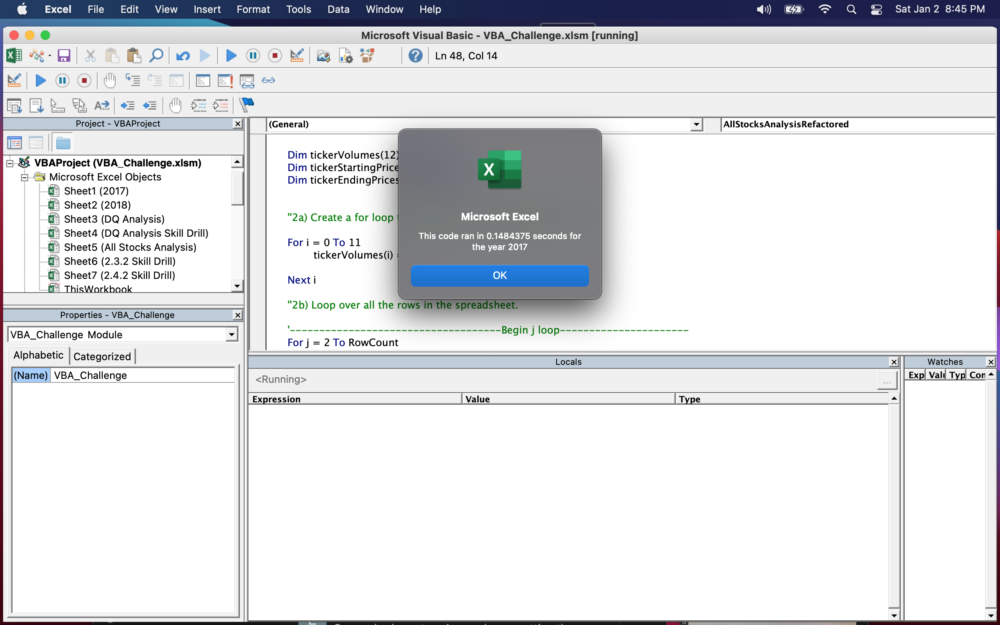
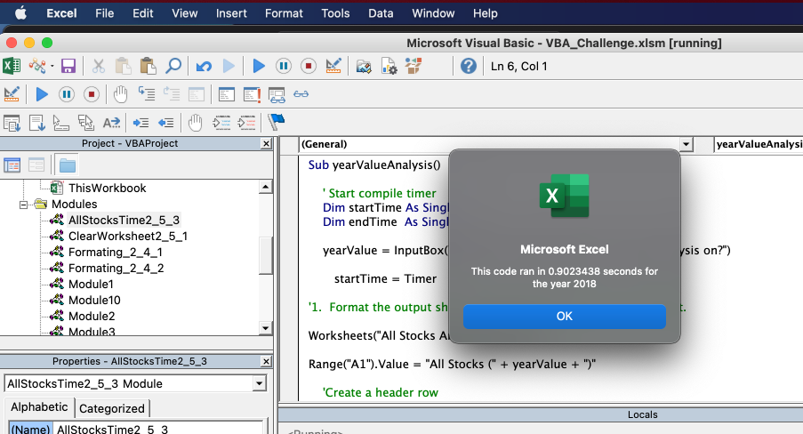
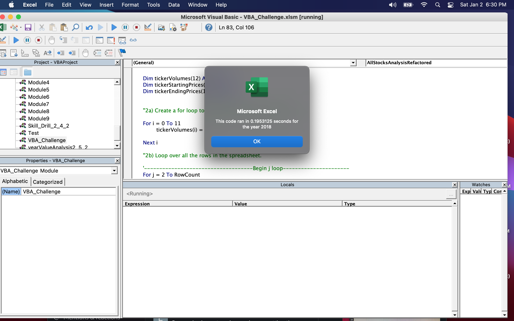

# Module 2: VBA of Wall Street Challenge

## Overview of Project
Refactor Module 2 Solution Code to run more effeciently

### Purpose
The purpose of this challenge was to update the Module 2 Solution Code using additional arrays to allow the macro to run faster.
 
 
 
## Results

### Stock Comparison Between 2017 and 2018
As can be seen by the screenshots of the All Stocks Charts for 2017 and 2018 below, overall, stocks in 2017 performed significantly better than those in 2018.
There were a one exceptionts:
1. Stock ticker RUN performed better in 2018 than in 2017 although it had positive returns both years.
2. Stock Ticker TERP also performed better in 2018 although it had negative returns both years.

#### All Stocks Analysis Chart (2017)                                            
      
#### All Stocks Analysis Chart (2018)



### Time Comparisons between Original Module 2 Solution Code and the Challenge Refactored Code
Updating the code using additional arrays did decrease the amount of time required to execute the macros

Additional arrays were used to calculate the Total Volume, Starting Prices, and Ending Prices.  A tickerIndex variable was used to represent the various array indexes.  See comparison below.  Notice that `totalVolume` from the Original Module 2 Solution became `totalVolumes(tickerIndex)` with `tickerIndex` being the array index itterator.

#### Original Module 2 Solution Code Example:
```
'4.  Loop through the tickers.

        For i = 0 To 11
            ticker = tickers(i)
            totalVolume = 0

'5.  Loop through rows in the data.

        Worksheets("2018").Activate
            For j = 2 To RowCount
            
'       Find the total volume for the current ticker.

                If Cells(j, 1).Value = ticker Then
                        
                        totalVolume = totalVolume + Cells(j, 8).Value
                        
                End If
                
            
'       Find the starting price for the current ticker.

                If Cells(j - 1, 1).Value <> ticker And Cells(j, 1).Value = ticker Then
                        
                        startingPrice = Cells(j, 6).Value
                        
                End If
```

#### Challenge Refactored Code Example:
```
'2a) Create a for loop to initialize the tickerVolumes to zero.
    
    For i = 0 To 11
            tickerVolumes(i) = 0
            
    Next i
    
    ''2b) Loop over all the rows in the spreadsheet.
    
    '------------------------------------Begin j loop----------------------
    For j = 2 To RowCount
    
        '3a) Increase volume for current ticker
        
        tickerVolumes(tickerIndex) = tickerVolumes(tickerIndex) + Cells(j, 8).Value
        
        '3b) Check if the current row is the first row with the selected tickerIndex.
        'If  Then
            
        If Cells(j - 1, 1).Value <> tickers(tickerIndex) And Cells(j, 1).Value = tickers(tickerIndex) Then
                        
                        tickerStartingPrices(tickerIndex) = Cells(j, 6).Value
                        
        End If
        
```


#### **The Screenshots Below Provide 2017 All Stock Analysis Macro Execution Comparison Between (A)The Original Module 2 Solution Code and (B)The Challenge Refactored Code**                                            
(A)


(B)

 
 
 
#### **The Following Screenshots Provide 2018 All Stock Analysis Macro Execution Comparison Between (C)The Original Module 2 Solution Code and (D)The Challenge Refactored Code**                                            
(C)



(D)

 
 
 
 
## Summary  

### What are the advantages or disadvantages of refactoring code?
- Advantage(s): Can cause the macro to run faster/more efficiently
- Disadvantage(s): More efficient coding can be harder to understand

### How do these pros and cons apply to refactoring the original VBA script?
Both the advantage and disadvantage listed above applied to refactoring the original VBA script.  The advantage is shown in comparing the times shown in the screensheets above in Results A, B, C,& D.  For a further explanation of the disadvantages, see the Challenges section below.


## Challenges
This assignment was very challenging.
1. It was not understood what inititalizing `tickerVolumes(i)` to zero actually does as the indexes are already initialized to zero when creating the array.
   A significant amount of time was spent to gain understanding of this.
    ### Example:
    ```
    '1b) Create three output arrays
    
    Dim tickerVolumes(12) As Long
    Dim tickerStartingPrices(12) As Single
    Dim tickerEndingPrices(12) As Single
    
    
    '2a) Create a for loop to initialize the tickerVolumes to zero.
    
        For i = 0 To 11
                tickerVolumes(i) = 0
            
        Next i
     ```
2. The greatest amount of time was spent figuring out whether or not, and how, to use the tickerIndex variable to iterate array indexes:
    ### Example:
    ```
    For j = 2 To RowCount
    
        '3a) Increase volume for current ticker
        
        tickerVolumes(tickerIndex) = tickerVolumes(tickerIndex) + Cells(j, 8).Value
        
        '3b) Check if the current row is the first row with the selected tickerIndex.
        'If  Then
            
        If Cells(j - 1, 1).Value <> tickers(tickerIndex) And Cells(j, 1).Value = tickers(tickerIndex) Then
                        
                        tickerStartingPrices(tickerIndex) = Cells(j, 6).Value
        End If
     ```
